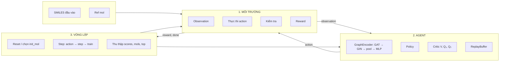

## Tổng quan Geom-SAC (tiếng Việt)

### Sơ đồ pipeline chính



**Thành phần chính và thành phần con:**

| Khối lớn | Thành phần con |
|----------|----------------|
| **1. Môi trường** | Observation (đồ thị: node, edge, feature); Thực thi action (thêm nguyên tử, thêm/sửa/xóa bond, nối mảnh); Kiểm tra (valency, chemical validity, stereo); Tính reward (QED, similarity, validity). |
| **2. Agent** | **GraphEncoder**: GAT → GIN → global_add_pool → MLP (đồ thị → embedding); **Policy** (actor): embedding → action; **Critic**: V(s), Q₁(s,a), Q₂(s,a); **ReplayBuffer**: lưu (s, a, r, s′, done). |
| **3. Vòng lặp** | Mỗi episode: chọn phân tử đầu vào, reset env; Trong episode: lặp bước (agent chọn action → env.step → add buffer → agent.train); Thu thập kết quả (scores, mols, top). |

---

### TL;DR

- **Bạn đang có gì**: Một agent SAC + GNN sinh / tối ưu phân tử 3D, code đã viết sẵn.
- **Bạn điều khiển được gì**: Tập SMILES đầu vào, phân tử ref, không gian nguyên tử/bond, tham số SAC, số episode, ngưỡng QED, v.v.
- **Bạn thu được gì**: Một tập phân tử mới (SMILES) hợp lệ hoá học, QED cao, có thể gần giống ref.
- **File này giúp gì**: Giải thích pipeline trực quan, các edge case hoá học, và liệt kê các nút bấm (hyper-parameters) quan trọng.

---

### 1. Mục tiêu của project

- **Geom-SAC** là implementation của bài báo *“Geometric Multi-Discrete Soft Actor Critic With Applications in De Novo Drug Design”*.
- **Mục tiêu**: dùng **deep reinforcement learning + GNN** để:
  - Sinh **phân tử mới** (de novo design), hoặc
  - **Tối ưu** phân tử có sẵn (lead optimization),
  - Trong khi đảm bảo phân tử **drug-like (QED cao)**, **hợp lệ hóa học**, và (tuỳ cấu hình) **giống một phân tử tham chiếu** (`reference_mol`).

---

### 2. Input, output và kịch bản “đa phân tử”

- **Input chính**:
  - **Tập phân tử ban đầu** (SMILES) – trong code hiện tại chỉ có 1 SMILES trong list, nhưng có thể mở rộng thành nhiều.
  - **Một phân tử tham chiếu** (`reference_mol`) – cũng cho dưới dạng **SMILES**, sau đó chuyển thành `Chem.Mol` bằng `Chem.MolFromSmiles(...)`.
  - Các hyper-parameters: `max_atom`, `max_action`, số episode (`n_episodes`), v.v.

- **Cách dùng khi có nhiều phân tử đầu vào**:
  - Ta có một **list SMILES**: `[A, B, C, ...]`.
  - Mỗi **episode**: `np.random.choice` chọn **ngẫu nhiên 1 phân tử** trong list làm **điểm xuất phát**.
  - Agent chỉnh sửa phân tử này qua nhiều bước → nhận được **1 phân tử cuối** cho episode đó.
  - Chạy `n_episodes` → có tối đa `n` phân tử cuối khác nhau (mỗi episode một phân tử).

- **Output**:
  - `mols`: danh sách SMILES của **phân tử cuối** mỗi episode.
  - `scores`: tổng reward của từng episode.
  - `top`: những phân tử **“tốt” vượt ngưỡng QED** (ví dụ `Chem.QED.qed(...) > 0.79`), coi như **các ứng viên lead**.

> Tức là: **m phân tử đầu vào (pool), n episode → tối đa n phân tử đầu ra**, mỗi phân tử đầu ra được sinh ra từ một trong các phân tử đầu vào, thông qua RL.

---

### 3. Ba bước core của pipeline

#### 3.1. Bước 1 – Môi trường `MolecularGraphEnv` (file `MolGraphEnv.py`)

- **Trạng thái (state)**: một phân tử hiện tại, biểu diễn dưới dạng:
  - **Đồ thị phân tử**: node = nguyên tử, edge = liên kết.
  - Node features: loại nguyên tử, số hiệu nguyên tử, aromatic hay không, hybridization, degree, số H, v.v.
  - Edge features: loại liên kết (single/double/triple/aromatic).
  - Dạng trả về: `torch_geometric.data.Data(x, edge_index, edge_attr)` (framework `'pyg'`).
  - Có thử embed 3D (AddHs + `AllChem.EmbedMolecule` + `MMFFOptimizeMolecule`); nếu lỗi có thể đặt `self.stop = True`.

- **Action space**:
  - Được định nghĩa là **`gym.spaces.MultiDiscrete`** với 5 thành phần:
    - `a0`: chỉ số **loại nguyên tử** mới (`possible_atom_types`).
    - `a1`: chỉ số **node thứ 1** (chỉ số nguyên tử trong phân tử hiện tại).
    - `a2`: chỉ số **node thứ 2**.
    - `a3`: chỉ số **loại liên kết** (`possible_bond_types`: SINGLE, DOUBLE, TRIPLE, AROMATIC).
    - `a4`: chỉ số **kiểu thao tác**:
      - `0`: nối các mảnh phân tử (`_connect_mol_frags`),
      - `1`: thêm liên kết (`_add_bond`),
      - `2`: đổi loại liên kết (`_alter_bond`),
      - `3`: xoá liên kết (`_remove_bond`).

- **Một action** là **một vector 5 chiều** `[a0, a1, a2, a3, a4]`, không phải 5 action tách biệt.  
  → Mỗi bước, agent **chọn 1 tổ hợp cụ thể** của 5 số này.

- **Luồng xử lý trong `step(action)`** (đơn giản hoá):
  1. **Sao lưu** phân tử cũ: `mol_old = deepcopy(self.mol_g)`.
  2. **Kiểm tra điều kiện dừng thô**: nếu số bước (`counter`) hoặc số action lỗi (`invalid_actions`) vượt `max_action`, đặt `self.stop = True`.
  3. Nếu số nguyên tử hiện tại ≤ `max_atom`:
     - Gọi `_add_atom(a0)` → **luôn thêm 1 nguyên tử mới** (kể cả khi `a4` là remove/alter/connect).
  4. Tính `node_id_1`, `node_id_2` từ `a1, a2` với một số logic fallback khi index lệch.
  5. Tuỳ `a4`:
     - `1` → `_add_bond(action, node_id_1, node_id_2)`,
     - `0` → `_connect_mol_frags()`,
     - `2` → `_alter_bond(action, node_id_1, node_id_2)`,
     - `3` → `_remove_bond(node_id_1, node_id_2)`,
     - Mỗi thao tác đều được bọc trong `try/except`: nếu lỗi → tăng `invalid_actions`, rollback về `mol_old` hoặc chọn mol “tốt nhất” trong `mols` tạm.
  6. Sau khi thao tác xong, mới **đánh giá**:
     - `check_valency()`:
       - Nếu **fail** → phạt reward, rollback về `mol_old`, tăng `invalid_actions`.
     - `check_chemical_validity()`:
       - Nếu pass → cộng một phần reward dựa trên QED.
       - Nếu fail → không rollback trong bước này, nhưng cuối episode sẽ bị phạt nặng hơn.
     - `check_stereo()` (embed 3D + MMFF):
       - Nếu fail → phạt reward, rollback về `mol_old`, tăng `invalid_actions`.
     - Nếu có `reference_mol` và `target_sim` → cộng thêm phần reward dựa trên độ giống (từ Morgan fingerprint + Tanimoto).
  7. Nếu `self.stop` hoặc `counter >= max_action`:
     - Tính **reward cuối** (kết hợp validity, QED, cấu trúc 3D, similarity) và trả `done=True`.
     - Reset lại một số biến đếm cho episode mới.
  8. Ngược lại:
     - Episode tiếp tục, trả về `(observation, reward_step, done=False, info)`.

#### 3.2. Bước 2 – Agent SAC + GNN (file `agent.py`, `neural_networks.py`)

- **GraphEncoder**:
  - Nhận `state` (đồ thị PyG) → qua `GAT` rồi `GIN` → global pooling → MLP → ra **vector embedding** kích thước cố định (ví dụ 128).
  - Đây là biểu diễn của phân tử mà các mạng tiếp theo (actor/critic) sử dụng.

  **GAT + GIN dùng để làm gì?**  
  Môi trường trả về **observation** dạng đồ thị (số nút, cạnh thay đổi theo phân tử), trong khi policy và critic là MLP cần **đầu vào có kích thước cố định**. GAT và GIN chính là bước **chuyển đồ thị thành embedding** — một vector số có chiều cố định — để mô hình “hiểu” được cấu trúc phân tử (nguyên tử, liên kết, tính chất) và từ đó quyết định action tiếp theo. Tóm lại: *observation (đồ thị) → GAT + GIN → embedding → policy/critic*.

  **GAT là gì (trực quan)?**  
  GAT (Graph Attention Network) dùng **attention**: khi mỗi nguyên tử (nút) cập nhật trạng thái của mình, nó không coi mọi nguyên tử kề cạnh như nhau, mà **gán trọng số** (học được) cho từng “hàng xóm”. Ví dụ trong phân tử có nhóm carbonyl (C=O): nguyên tử **O** có thể được GAT cho trọng số cao hơn so với một C bão hòa xa xôi — vì O ảnh hưởng mạnh đến tính chất/khả năng phản ứng. Nói ngắn: GAT trả lời câu hỏi *“trong ngữ cảnh này, nguyên tử/liên kết nào quan trọng hơn?”* và tạo ra biểu diễn giàu ngữ cảnh.

  **GIN là gì (trực quan)?**  
  GIN (Graph Isomorphism Network) **không dùng attention**: nó gộp thông tin từ hàng xóm theo cách đều đặn (thường là tổng), kèm một hệ số học được cho chính nút đó. Mục tiêu thiết kế là **phân biệt được các đồ thị có cấu trúc khác nhau**. Ví dụ hóa học: hai phân tử **benzene** (vòng 6 cạnh, liên kết thơm) và **cyclohexane** (vòng 6 cạnh, toàn liên kết đơn) — đồ thị có cùng “hình dạng” (6 nút, 6 cạnh) nhưng loại liên kết khác nhau; GIN (với feature nút/cạnh phù hợp) giúp embedding phân biệt được hai cấu trúc đó. Nói ngắn: GIN trả lời *“đồ thị này có cấu trúc gì, có khác đồ thị kia không?”*.

  **Tại sao GAT trước, GIN sau?**  
  - **GAT trước**: Đồ thị thô (node/edge features) trước tiên cần được “nâng cấp” thành biểu diễn **có ngữ cảnh** — nguyên tử/liên kết nào quan trọng trong phân tử này. GAT làm đúng việc đó, cho ra một đồ thị ẩn (hidden features) giàu ý nghĩa hơn.  
  - **GIN sau**: Trên nền biểu diễn đã có ngữ cảnh đó, GIN đảm nhiệm việc **tổng hợp và phân biệt cấu trúc** một cách ổn định (có cơ sở lý thuyết về sức mạnh phân biệt đồ thị). Kết quả sau global pooling là embedding vừa “biết trọng tâm” (nhờ GAT), vừa “nhạy với cấu trúc” (nhờ GIN), phù hợp để policy/critic đưa ra quyết định action.

  **GAT “biết” đâu quan trọng bằng cách nào?**  
  GAT không được lập trình sẵn “cái này quan trọng, cái kia không”. Tham số attention **học từ huấn luyện**: gradient (từ reward RL) cập nhật các trọng số sao cho biểu diễn dẫn đến action tốt (reward cao) được ưu tiên. **Gán sai** thì trong quá trình train loss cao, gradient sẽ chỉnh dần; mức độ “đúng” phụ thuộc chất lượng reward và dữ liệu.

  **Vai trò tóm tắt GAT vs GIN**  
  - **GAT**: tạo cách gán trọng số (và học cách gán) → embedding có “trọng tâm” → RL dùng embedding đó để đưa ra **action tiếp theo**.  
  - **GIN**: làm cho embedding **phân biệt được** các phân tử (đồ thị) **khác nhau** về cấu trúc — tức một bước xử lý để RL **tránh nhầm** hai phân tử khác bản chất là giống nhau.

  **Input và output của GIN**  
  - **Input**: (1) Node features = **output của GAT** `h1` (shape `[số_nút, dim_h]`), (2) **Cấu trúc đồ thị** `edge_index` (không đổi).  
  - **Output**: **Per-node embeddings** `h2` (shape `[số_nút, dim_h]`). GIN **không** trả ra nhãn “giống/khác”; nó trả ra **một biểu diễn** cho đồ thị đó. Embedding **cả phân tử** là **sau bước pool** (ví dụ `global_add_pool(h2)`) → một vector; **phân biệt hai phân tử** = so sánh hai vector đó (cấu trúc khác → embedding khác).

  **Làm sao embedding ít bị lẫn với phân tử khác?**  
  - **Thiết kế GIN**: Phép gộp (aggregation) của GIN được thiết kế **injective** (hai multiset hàng xóm khác nhau → vector khác nhau), với sức mạnh ít nhất bằng Weisfeiler–Lehman (WL); cấu trúc khác → biểu diễn khác.  
  - **Học**: Khi hai phân tử gần giống nhưng khác bản chất mà embedding lại quá giống → policy có thể hành xử sai → reward kém → gradient đẩy mạng chỉnh để **hai embedding tách xa nhau** khi cần phân biệt.  
  - **Pool**: GIN ra per-node → `global_add_pool` gộp thành một vector cho cả đồ thị; vector đó nhạy với cấu trúc nhờ GIN và được tinh chỉnh bởi training.

  **GIN như injective encoding**  
  GIN bản chất là một dạng **injective encoding/embedding**: thiết kế đảm bảo **cấu trúc khác → embedding khác** (ít nhất trong phạm vi sức mạnh của WL). Lưu ý: WL không phân biệt được mọi cặp đồ thị không đẳng cấu; trong thực tế đồ thị phân tử, GIN thường đủ để coi như embedding ít bị trùng cho phần lớn trường hợp.

- **Mạng trong SAC**:
  - `StateValueNetwork` (`V(s)`): ước lượng giá trị của state.
  - `ActionValueNetwork` (`Q(s,a)`): 2 mạng độc lập (`critic_q_1`, `critic_q_2`) để dùng `min(Q1, Q2)` như trong SAC chuẩn.
  - `PolicyNetwork`:
    - Nhận embedding state → xuất **logits** cho toàn bộ không gian MultiDiscrete (gộp 5 chiều lại).
    - Dùng `MultiCategoricalDistribution` để sinh ra **xác suất** và **sample action** `[a0, a1, a2, a3, a4]`, kèm theo `log_prob`.

- **Quá trình học (`agent.train()`)**:
  - Lấy batch `(states, probabilities, rewards, next_states, dones)` từ `ReplayBuffer`.
  - Cập nhật:
    - **Q-networks**: MSE giữa `Q(s,a)` và `target_q = r * reward_scale + γ * V_target(s') * (1-done)`.
    - **V-network**: MSE giữa `V(s)` và `min(Q1, Q2) - log π(a|s)`.
    - **Policy**: loss dạng SAC, tối ưu trade-off giữa Q và entropy.
  - Soft update `critic_v_target` với hệ số `tau`.

#### 3.3. Bước 3 – Vòng lặp huấn luyện (file `main.py`)

- Mỗi **episode**:
  1. Chọn ngẫu nhiên 1 SMILES từ list → `init_mol`.
  2. Tạo `MolecularGraphEnv(mol_g=init_mol, reference_mol=ref_mol, target_sim=1, max_atom=40, ...)`.
  3. `state = env.reset(frame_work='pyg')`.
  4. Encode state bằng `GraphEncoder` → embedding.
  5. Tạo agent `SoftActorCriticAgent(env, state)`.

- Trong **vòng lặp bước** của episode:
  1. Agent `select_actions(state)` → `(probabilities, actions, log_p)`.
  2. `next_state, reward, done, info = env.step(actions[0].detach().cpu().numpy())`.
  3. Encode `next_state` bằng `GraphEncoder` khác → embedding mới.
  4. Thêm transition vào buffer: `(state, probabilities, reward, next_state, done)`.
  5. Gọi `agent.train()`.
  6. Cập nhật `state = next_state`, cộng dồn `rewards`.
  7. Nếu `done` → kết thúc episode, lưu:
     - `scores.append(rewards)`,
     - SMILES của phân tử cuối vào `mols`,
     - Nếu QED vượt ngưỡng → cho vào `top`.

---

### 4. Điều kiện dừng của một episode

- Episode dừng khi `env.step` trả `done=True`. Trong code:

- **Hai điều kiện chính**:
  - **Hết số bước tối đa**:
    - `self.counter >= self.max_action`.
  - **Quá nhiều action không hợp lệ**:
    - `self.invalid_actions > self.max_action`.

> Không có điều kiện “QED đủ cao thì dừng sớm”; dừng hoàn toàn do **giới hạn số bước** và **số lần phạm lỗi**.

---

### 5. Reference molecule và vấn đề “converge”

- `reference_mol` được dùng để tính **độ giống (similarity)** với phân tử hiện tại qua Morgan fingerprint + Tanimoto.
- Reward có một phần thưởng thêm nếu phân tử hiện tại **gần giống** ref (theo một hàm biến đổi của similarity).

**Hiệu ứng khi dùng chung một ref cho mọi episode**:

- Tất cả các episode đều:
  - Bắt đầu từ các phân tử khác nhau nhưng
  - Đều bị **kéo về gần ref** bởi reward.

- **Nguy cơ**:
  - Agent (một policy dùng chung) có thể học một số **chiến lược “tối ưu” giống nhau** để tăng similarity với ref.
  - Dần dần nhiều phân tử sinh ra sẽ **giống nhau hơn** (giảm diversity), tất cả tập trung quanh ref.

- Tuy nhiên:
  - Nhiều điểm xuất phát khác nhau + tính ngẫu nhiên của policy → vẫn có thể sinh ra **nhiều local optimum khác nhau**, không hoàn toàn collapse về 1 phân tử duy nhất.
  - Không có thành phần reward nào **buộc** các phân tử output phải giống nhau, chỉ là **cùng giống ref**.

> Kết luận: dùng chung ref **có xu hướng làm phân tử “converge” về vùng gần ref**, giảm đa dạng, nhưng không nhất thiết sụp đổ về một cấu trúc duy nhất. Để tăng diversity, cần thêm các term/phương án thưởng phạt về đa dạng.

---

### 6. Cách env xử lý action “sai” và hợp lệ hóa học

- **Không raise exception ra ngoài** cho agent; tất cả được xử lý nội bộ trong `step`:
  - Thao tác bond (add/alter/remove/connect) được bọc trong `try/except`:
    - Nếu lỗi → tăng `invalid_actions`, rollback phân tử về `mol_old` (hoặc chọn mol tốt nhất trong danh sách thử nghiệm tạm).

- **Kiểm tra hoá trị (valency)**:
  - Dùng `Chem.SanitizeMol(..., sanitizeOps=Chem.SanitizeFlags.SANITIZE_PROPERTIES)`.
  - Nếu fail:
    - Phạt reward step,
    - Rollback `self.mol_g = mol_old`,
    - `invalid_actions += 1`.

- **Kiểm tra hoá học tổng quát (chemical validity)**:
  - SMILES round-trip: `MolToSmiles` → `MolFromSmiles` → `SanitizeMol`.
  - Nếu không hợp lệ:
    - Hàm `check_chemical_validity()` trả `False`,
    - Không cộng reward QED ở bước đó,
    - Cuối episode sẽ phạt thêm (giảm `reward_valid`, v.v.),
    - Không rollback ngay trong `step` chỉ vì chemical validity.

- **Kiểm tra stereo / 3D**:
  - Thử AddHs, EmbedMolecule, MMFFOptimize:
    - Nếu tối ưu thành công → coi là stereo/3D ok.
    - Nếu không → phạt reward, rollback `mol_g` về `mol_old`, tăng `invalid_actions`.

> Tóm lại: env **đẩy mạnh** việc phạt và rollback các action tạo ra trạng thái không hợp lệ (đặc biệt là valency, stereo), nhưng không đảm bảo chặn **toàn bộ** mọi trường hợp vi phạm quy tắc hoá hữu cơ phức tạp; nó dựa nhiều vào khả năng của RDKit.

---

### 7. Thiết kế action và các edge case quan trọng

#### 7.1. Action luôn gồm 5 thành phần

- Một **action** = vector `[a0, a1, a2, a3, a4]`.
- Ý nghĩa:
  - `a0`: loại nguyên tử để thêm.
  - `a1, a2`: 2 node để thao tác liên kết.
  - `a3`: loại liên kết.
  - `a4`: kiểu thao tác (connect/add/alter/remove bond).

#### 7.2. Edge case 1 – Luôn “thêm nguyên tử” dù chỉ remove bond

- Trong `step`, **mỗi bước** (miễn là số nguyên tử chưa vượt `max_atom`), env sẽ gọi:
  - `_add_atom(a0)` trước, **bất kể** `a4` là gì.
- Ví dụ: `a4 = 3` (remove bond):
  - Env **vẫn thêm 1 nguyên tử mới** theo `a0`,
  - Sau đó mới xoá một liên kết giữa `node_id_1` và `node_id_2`.
- Kết quả:
  - Có thể xuất hiện **nguyên tử “lơ lửng”** không gắn với ai (isolated atom),
  - Hoặc tạo thêm fragments mới.
- Về mặt hoá hữu cơ chuẩn, đây là hành vi **không tự nhiên** (không ai “tự dưng sinh thêm 1 nguyên tử đơn lẻ”), nhưng:
  - Env dùng **reward + rollback** để trừng phạt các cấu trúc tệ,
  - Cuối cùng thường chỉ lấy **mảnh lớn nhất/hợp lý nhất** để đánh giá.

#### 7.3. Edge case 2 – Hàm `_connect_mol_frags()`

- Được gọi khi `a4 == 0`.
- Mục tiêu: **nối các mảnh rời rạc** trong phân tử:
  1. Tìm các nguyên tử còn “thiếu” valence.
  2. Xác định các fragment khác nhau.
  3. Sinh các cặp ứng viên `(node_1, node_2)` thuộc các mảnh khác nhau.
  4. Thử nối chúng bằng nhiều loại liên kết, embed 3D, tối ưu MMFF.
  5. Tính QED cho mỗi cấu hình nối, **chọn phân tử có QED cao nhất**.
  6. Nếu không nối được gì hợp lý → fallback:
     - Hoặc dùng `get_final_mols(old_mol)` để chọn mảnh lớn nhất,
     - Hoặc giữ nguyên `self.mol_g`.

> Đây là “cơ chế tự động hàn gắn” các mảnh rời, nhưng cũng là một vùng có thể sinh ra hành vi **không hoàn toàn phản ánh đầy đủ hoá hữu cơ thực tế**, mà là một thoả hiệp cho RL.

---

### 8. Những khác biệt so với hoá hữu cơ “chuẩn”

- **Không có khái niệm nguyên tử “vô duyên”** trong hoá hữu cơ, nhưng env có thể:
  - Thêm nguyên tử rồi không nối nó với phần còn lại,
  - Sinh ra nhiều fragment rời.
- Env cố gắng sửa bằng:
  - `_connect_mol_frags()` để nối lại,
  - `get_final_mols` để chỉ lấy **mảnh lớn nhất** khi đánh giá.
- **Không kiểm soát hết mọi quy tắc**:
  - Dựa vào RDKit (valency, aromaticity, charge, 3D) nên:
    - Nhiều trường hợp sai sẽ bị chặn/phạt,
    - Nhưng không thể khẳng định chặn hết 100% mọi quy tắc hoá hữu cơ tinh vi.

> Tổng thể, đây là một **môi trường RL hoá học thực dụng**, chấp nhận trạng thái trung gian “xấu” miễn là:
> - Bị phạt đủ mạnh,
> - Không được chọn làm phân tử cuối,
> - Và agent học được cách tránh chúng nhờ reward.

---

### 9. Gợi ý nếu muốn “hoá học hơn”

Nếu mục tiêu của bạn là mô phỏng **gần với tư duy hoá hữu cơ** hơn, có thể cân nhắc:

- **Tách riêng** action “thêm nguyên tử” và action “sửa/xoá/nối liên kết”, thay vì luôn thêm nguyên tử mỗi bước.
- **Rollback mạnh hơn** khi `check_chemical_validity()` fail (hiện tại chỉ ảnh hưởng reward).
- Thêm **reward/phạt về đa dạng** (diversity) để tránh converge quá nhiều quanh một ref.
- Bổ sung các chỉ số khác (synthetic accessibility, toxicity, ADMET, v.v.) nếu có model dự đoán.

---

Tài liệu này tóm tắt lại các nội dung đã trao đổi:
- Cách pipeline hoạt động từ input → env → agent → output.
- Trường hợp nhiều phân tử đầu vào.
- Vai trò của `reference_mol` và nguy cơ “converge”.
- Cách env xử lý action sai, rollback, invalid actions.
- Chi tiết về cấu trúc action 5 thành phần, các edge case (luôn thêm nguyên tử, nguyên tử lơ lửng, nối fragments).
- Hạn chế so với hoá hữu cơ “chuẩn” và một số hướng tinh chỉnh.

### 10. Phân loại các tham số có thể tuỳ chỉnh

Để rõ ràng hơn, chia tham số thành 4 nhóm chính: **hoá học**, **ML/RL**, **pipeline/thực nghiệm**, và **config**.

#### 10.1. Nhóm tham số **hoá học**

- **Tập phân tử đầu vào** (SMILES):
  - Quyết định **chemical space ban đầu** mà agent được phép “tối ưu”.
  - Thay đổi set này = thay bối cảnh hoá học mà RL làm việc.

- **`reference_mol`**:
  - Phân tử mục tiêu để tính similarity.
  - Đổi SMILES của ref = đổi **“đích hoá học”** mà agent bị kéo về.

- **`target_sim`**:
  - Mức độ similarity mục tiêu (ví dụ 1.0 = càng giống ref càng tốt).
  - Có thể điều chỉnh nếu muốn khuyến khích giống ref vừa phải thay vì giống tuyệt đối.

- **`allowed_atoms`** trong `MolecularGraphEnv`:
  - Quy định **nguyên tố hoá học nào có thể được thêm** vào phân tử.
  - Thay đổi list này = mở rộng/thu hẹp loại atoms (ví dụ thêm P, B, siêu nguyên tố…).

- **`max_atom`**:
  - Số nguyên tử tối đa trong một phân tử.
  - Liên quan trực tiếp đến:
    - Độ lớn phân tử (mol weight, độ phức tạp),
    - Khả năng nhúng 3D, ổn định cấu trúc,
    - Thời gian tính toán RDKit (embed, MMFF).

- **`max_action`** (mặc định 130):
  - Số bước tối đa trong một episode; cũng dùng làm ngưỡng để dừng sớm khi `invalid_actions` vượt quá.
  - Tăng → episode dài hơn, phân tử có thể phức tạp hơn; giảm → chạy nhanh, phân tử đơn giản hơn.

- **`min_action`** (mặc định 21):
  - Trong code được lưu nhưng không dùng trực tiếp trong điều kiện dừng; có thể tận dụng nếu muốn ép số bước tối thiểu.

- **`frame_work`** (`'pyg'` hoặc `'dgl'`):
  - Cách biểu diễn observation: PyTorch Geometric (`'pyg'`) hoặc DGL. Mặc định `'pyg'`; đổi `'dgl'` cần cài `dgl` và đảm bảo `get_observation` trả đúng format.

- **`reward_type`**:
  - Hiện đang là `"qed"`, tức reward cuối cùng ưu tiên **QED (drug-likeness)**.
  - Nếu mở rộng, có thể thêm các kiểu reward khác như logP, activity score, multi-objective, v.v.

- **Các kiểm tra hoá học dùng RDKit** (gián tiếp nhưng quan trọng):
  - Cách gọi `SanitizeMol`, `EmbedMolecule`, `MMFFOptimizeMolecule`, cách tính QED, cách chọn mảnh lớn nhất (`get_final_mols`) – đều là **lớp “hoá học”** mà bạn có thể chỉnh nếu đổi tiêu chí “phân tử tốt”.

#### 10.2. Nhóm tham số **ML/RL (học máy, học tăng cường)**

- **Trong `SoftActorCriticAgent`** (`agent.py`):
  - `gamma = 0.99`: hệ số chiết khấu (tầm nhìn dài/ngắn của agent).
  - `tau = 0.005`: tốc độ soft-update cho mạng value target.
  - `batch_size = 32`: số mẫu mỗi lần train từ replay buffer.
  - `reward_scale = 10`: nhân reward lên trước khi tính target Q → ảnh hưởng scale của Q-values.
  - **Learning rates**: `lr_actor = 0.003`, `lr_v = lr_q1 = lr_q2 = 0.003` (có thể chỉnh riêng từng optimizer).

- **Replay buffer** (`buffer.py`):
  - `maxlen = 500`: dung lượng tối đa của replay buffer (số transition lưu). Tăng nếu muốn học ổn định hơn trên nhiều mẫu; giảm nếu tiết kiệm bộ nhớ.

- **Trong `neural_networks.py`**:
  - Kiến trúc **GraphEncoder**:
    - `n_layers = 1`: số lớp GAT/GIN (có thể tăng để tăng độ sâu).
    - `dim_h = 128`: kích thước ẩn (đầu ra GAT/GIN, input MLP).
    - `heads = 4`: số head attention của GAT.
  - Kiến trúc các MLP (StateValueNetwork, ActionValueNetwork, PolicyNetwork):
    - `dim_h = 128`, các tầng 64 → có thể chỉnh kích thước hidden, số lớp.

- **Action space (MultiDiscrete)** – phía ML:
  - Cách “gói” action thành 5 chiều `[a0, a1, a2, a3, a4]` và dùng `MultiCategoricalDistribution`:
    - Ảnh hưởng tới **cách policy sinh hành động**,
    - Còn tập lựa chọn cụ thể (allowed_atoms, max_atom, bond types) là phía **hoá học**.

#### 10.3. Nhóm tham số **pipeline / thực nghiệm**

- **`n_episodes`** trong `main.py`:
  - Số episode huấn luyện:
    - Tham số **thực nghiệm/hậu cần**: càng lớn → học lâu hơn, kết quả tiềm năng tốt hơn nhưng tốn thời gian.

- **Ngưỡng chọn phân tử “tốt” cho `top`**:
  - Ví dụ trong code: `Chem.QED.qed(env.get_final_mol()) > 0.79`.
  - Đây là **ngưỡng thực nghiệm**:
    - 0.79 là lựa chọn tương đối tuỳ ý; bạn có thể nâng lên (ít nhưng rất “drug-like”) hoặc hạ xuống (nhiều candidate hơn).

- **Cách log/ghi kết quả**:
  - Hiện đang chỉ lưu `scores`, `mols`, `top`, `actor_loss` trong bộ nhớ.
  - Bạn có thể thêm:
    - Ghi ra file (`.csv`, `.smi`, ...),
    - Log thêm info từ `info` của env (reward_valid, reward_qed, reward_structure) để phân tích.

#### 10.4. Nhóm tham số **config**

- **`chkpt_dir`** (trong `neural_networks.py`):
  - Thư mục lưu checkpoint của actor, critic V, critic Q. Mặc định `'tmp/GeomSac'`. Đổi khi muốn lưu/load model ở vị trí khác.

- **`device`** (replay buffer, `buffer.py`):
  - Thiết bị lưu và stack tensor khi sample (hiện `'cpu'`). Có thể đổi nếu muốn đưa batch lên GPU.

- **Số phân tử in ra trong summary** (`main.py`):
  - Số dòng SMILES được in cho `mols` và `top` ở cuối run (hiện `mols[:5]`, `unique_top[:5]` → tối đa 5). Chỉ ảnh hưởng đầu ra console, không đổi kết quả train.

- **Hệ số reward (trong `step` và cuối episode)** (`MolGraphEnv.py`):
  - Nhiều hằng số cấu hình reward: thưởng/phạt valency và stereo (`± 1/max_action`), hệ số QED từng bước (`(1.5 - ...)/20`), reward cuối (reward_valid, reward_geom, reward_qed nhân 2, similarity). Chỉnh để cân bằng giữa validity, QED và similarity.

#### Bảng tổng kết: Các tham số có thể thay đổi được

| Tham số | Nhóm | Vị trí (file) | Giá trị mặc định / ví dụ | Mô tả ngắn |
|--------|------|----------------|---------------------------|------------|
| **Tập SMILES đầu vào** | Hoá học | `main.py` | List 1 SMILES | Pool phân tử xuất phát mỗi episode. |
| **`reference_mol`** | Hoá học | `main.py` | 1 Mol (từ SMILES) | Phân tử mục tiêu để tính similarity. |
| **`target_sim`** | Hoá học | `main.py` → env | `1` | Mức similarity mục tiêu với ref. |
| **`allowed_atoms`** | Hoá học | `MolGraphEnv.py` | `["C","Cl","F","I","K","N","Na","O","S","Br"]` | Nguyên tố được phép thêm vào phân tử. |
| **`max_atom`** | Hoá học | `MolGraphEnv.py` / `main.py` | `35` (env), `40` (main) | Số nguyên tử tối đa trong một phân tử. |
| **`max_action`** | Hoá học / Pipeline | `MolGraphEnv.py` | `130` | Số bước tối đa mỗi episode; ngưỡng dừng sớm theo invalid_actions. |
| **`min_action`** | Hoá học | `MolGraphEnv.py` | `21` | Lưu trong env; có thể dùng cho logic số bước tối thiểu. |
| **`reward_type`** | Hoá học | `MolGraphEnv.py` | `"qed"` | Loại reward cuối (hiện chỉ QED). |
| **Hệ số reward (step & cuối episode)** | Config | `MolGraphEnv.py` | Nhiều hằng số (valency ±1/max_action, QED, reward_valid/geom/qed, similarity) | Cân bằng validity, QED, similarity. |
| **`frame_work`** | Pipeline | `MolGraphEnv.py`, `main.py` | `'pyg'` | Đồ thị: `'pyg'` (PyG) hoặc `'dgl'`. |
| **`n_episodes`** | Pipeline | `main.py` | `5000` | Số episode huấn luyện. |
| **Ngưỡng QED cho `top`** | Pipeline | `main.py` | `0.79` | Chỉ lưu phân tử có QED > ngưỡng này. |
| **`gamma`** | ML/RL | `agent.py` | `0.99` | Hệ số chiết khấu (discount). |
| **`tau`** | ML/RL | `agent.py` | `0.005` | Hệ số soft-update cho V_target. |
| **`batch_size`** | ML/RL | `agent.py`, `buffer.py` | `32` | Số mẫu mỗi lần train từ buffer. |
| **`reward_scale`** | ML/RL | `agent.py` | `10` | Nhân reward khi tính target Q. |
| **`lr_actor`, `lr_v`, `lr_q1`, `lr_q2`** | ML/RL | `agent.py` | `0.003` | Learning rate cho actor và từng critic. |
| **`maxlen` (replay buffer)** | ML/RL | `buffer.py` | `500` | Số transition tối đa trong replay buffer. |
| **`n_layers`** (GAT/GIN) | ML/RL | `neural_networks.py` (GraphEncoder) | `1` | Số lớp GAT và GIN. |
| **`dim_h`** | ML/RL | `neural_networks.py` | `128` | Kích thước ẩn (GAT, GIN, MLP). |
| **`heads`** (GAT) | ML/RL | `neural_networks.py` (GraphEncoder) | `4` | Số head attention của GAT. |
| **`dim_hidden` (MLP V, Q)** | ML/RL | `neural_networks.py` (StateValueNetwork, ActionValueNetwork) | `64` | Kích thước tầng ẩn thứ hai (128 → 64 → 1). |
| **`epsilon`** (policy sample) | ML/RL | `neural_networks.py` (PolicyNetwork.sample) | `1e-6` | Hằng số ổn định số học khi sample action (tránh log 0). |
| **`chkpt_dir`** | Config | `neural_networks.py` | `'tmp/GeomSac'` | Thư mục lưu checkpoint actor / critic V / critic Q. |
| **`device`** (replay buffer) | Config | `buffer.py` | `'cpu'` | Thiết bị lưu và stack tensor khi buffer.sample(). |
| **Số phân tử in ra (summary)** | Config | `main.py` | `5` | Số SMILES in cho mols và top ở cuối run (mols[:5], unique_top[:5]). |

---

### 11. Setup và chạy pipeline

#### 11.1. Yêu cầu hệ thống

- **Python**: 3.9 trở lên (khuyến nghị 3.10 hoặc 3.11).
- **Hệ điều hành**: Linux, macOS, Windows (RDKit có thể cần cài thêm trên Windows).

#### 11.2. Cài đặt thư viện

**Bước 1 – Tạo môi trường ảo (khuyến nghị):**

```bash
python -m venv venv
source venv/bin/activate   # Linux/macOS
# hoặc: venv\Scripts\activate   # Windows
```

**Bước 2 – Cài PyTorch (tuỳ theo CPU/GPU):**

```bash
# CPU only
pip install torch

# GPU (CUDA 11.8)
pip install torch --index-url https://download.pytorch.org/whl/cu118

# GPU (CUDA 12.1)
pip install torch --index-url https://download.pytorch.org/whl/cu121
```

**Bước 3 – Cài các thư viện còn lại:**

```bash
pip install -r requirements.txt
```

**Lưu ý**:
- `torch-geometric` phụ thuộc phiên bản PyTorch; nếu lỗi, xem [PyTorch Geometric install](https://pytorch-geometric.readthedocs.io/en/latest/install/installation.html).
- **RDKit**: trên một số hệ thống cần cài riêng, ví dụ:
  - `conda install -c conda-forge rdkit` (nếu dùng conda),
  - hoặc `pip install rdkit` (thường đủ trên Linux/macOS).

#### 11.3. Cấu trúc thư mục

```
Geom-SAC/
├── GeomSAC/
│   ├── main.py           # Điểm vào chạy pipeline
│   ├── MolGraphEnv.py     # Môi trường RL
│   ├── agent.py          # Agent SAC
│   ├── neural_networks.py # GNN + mạng SAC
│   ├── buffer.py         # Replay buffer
│   └── utils.py          # Tiện ích hoá học
├── requirements.txt
├── GeomSAC_tong_quan_vi.md
└── README.md
```

#### 11.4. Câu lệnh chạy

**Chạy từ thư mục gốc project:**

```bash
cd /path/to/Geom-SAC
python -m GeomSAC.main
```

**Hoặc chạy từ trong thư mục `GeomSAC`:**

```bash
cd Geom-SAC/GeomSAC
python main.py
```

> **Lưu ý**: `main.py` dùng `from MolGraphEnv import *`, `from agent import *` nên cần chạy từ đúng thư mục để Python tìm được các module. Nếu chạy `python main.py` từ `GeomSAC/`, cần đảm bảo thư mục hiện tại nằm trong `sys.path` (thường là mặc định khi chạy từ `GeomSAC/`).

**Chạy với số episode ít (test nhanh):**

Sửa trong `main.py`:

```python
n_episodes = 100  # thay vì 5000
```

rồi chạy lại `python main.py`.

#### 11.5. File `requirements.txt`

Nội dung mẫu (đã tạo trong project):

```text
# Geom-SAC dependencies
# Python >= 3.9 recommended

# Core
numpy>=1.21.0
gymnasium>=0.29.0

# Deep learning
torch>=2.0.0
torch-geometric>=2.4.0

# Reinforcement learning (dùng cho MultiCategoricalDistribution)
stable-baselines3>=2.0.0

# Chemistry
rdkit>=2023.3.1
```

#### 11.6. Xử lý lỗi thường gặp

| Lỗi | Gợi ý xử lý |
|-----|-------------|
| `ModuleNotFoundError: No module named 'rdkit'` | Cài RDKit: `pip install rdkit` hoặc `conda install -c conda-forge rdkit` |
| `ModuleNotFoundError: No module named 'torch_geometric'` | Cài PyTorch trước, sau đó `pip install torch-geometric` |
| `ImportError` từ `utils` (thiếu `copy`, `Chem`) | Thêm vào đầu `utils.py`: `import copy` và `from rdkit import Chem` |
| Lỗi CUDA / GPU | Chạy với CPU: cài `torch` bản CPU-only |
| `dgl` không tìm thấy | Chỉ cần khi dùng `frame_work='dgl'`; mặc định dùng `'pyg'` nên có thể bỏ qua |

---

### 12. Các chỉnh sửa cục bộ khi chạy trên máy local

Phần này ghi lại các chỉnh sửa mình đã thực hiện trên mã nguồn gốc của repo/paper để:
- Chạy được với môi trường Python/RDKit/Gymnasium hiện tại.
- Thêm log/giải thích giúp quan sát quá trình huấn luyện dễ hơn.

#### 12.1. Cập nhật `requirements.txt`

So với nội dung mẫu ở mục 11.5, file `requirements.txt` hiện tại đã được cố định version cụ thể hơn để tránh xung đột và lỗi build:

```text
# Geom-SAC dependencies
# Note: versions chosen to be close to the likely
# stack when the original repo was implemented,
# while keeping dependencies mutually compatible.

# Core
# Use a NumPy version with prebuilt wheels for recent Python versions (>=3.11).
numpy>=1.26,<2.0
gymnasium==0.29.1

# Deep learning
torch==2.2.0
torch-geometric==2.4.0

# Reinforcement learning (dùng cho MultiCategoricalDistribution)
stable-baselines3==2.3.2

# Chemistry
rdkit==2023.9.5
```

**Lý do:**

- Tránh xung đột `gymnasium` với `stable-baselines3` (SB3 2.3.2 yêu cầu `gymnasium>=0.28.1,<0.30`).
- Dùng `numpy>=1.26,<2.0` để có wheel sẵn cho Python 3.12, tránh lỗi “Getting requirements to build wheel did not run successfully”.
- Chọn `rdkit==2023.9.5` thay vì bản 2025.x quá mới (nhiều deprecation + nghiêm hơn), nhưng vẫn đủ mới để cài được trên môi trường hiện tại.

#### 12.2. Vá `RingInfo not initialized` trong `GeomSAC/MolGraphEnv.py`

Trong hàm `get_similarity` gốc, tác giả gọi:

- `AllChem.GetMorganFingerprint(n, radius=2)`
- `AllChem.GetMorganFingerprint(m, radius=2)`

trên bản sao của `reference_mol` và `mol_g` mà không đảm bảo đã được `SanitizeMol`. Với RDKit mới, điều này dễ gây lỗi:

- `Pre-condition Violation`
- `RingInfo not initialized`

**Chỉnh sửa đã làm:**

- Thêm bước sanitize trước khi tính fingerprint:

```python
def get_similarity(self):
    n = copy.deepcopy(self.reference_mol)
    m = copy.deepcopy(self.mol_g)

    # Local compatibility fix for newer RDKit versions:
    # ensure ring information and other properties are initialized
    # on the copied molecules before computing Morgan fingerprints.
    try:
        Chem.SanitizeMol(n)
        Chem.SanitizeMol(m)
    except Exception:
        # If sanitization fails, fall back to zero similarity
        # instead of triggering RingInfo pre-condition violations.
        return 0.0

    fp_n = AllChem.GetMorganFingerprint(n, radius=2)
    fp_m = AllChem.GetMorganFingerprint(m, radius=2)
    curr_sim = DataStructs.TanimotoSimilarity(fp_n, fp_m)

    return 1 - np.sqrt(abs(self.target_sim - curr_sim) / (self.target_sim + curr_sim) ** 2)
```

**Lý do:**

- Đây là cách RDKit khuyến cáo: luôn sanitize trước khi dùng Morgan fingerprint để đảm bảo `RingInfo` và các thuộc tính khác đã được khởi tạo.
- Giữ nguyên công thức similarity của paper, chỉ thêm lớp “an toàn” để không bị crash trên RDKit bản mới.

#### 12.3. Sửa `Chem.Descriptors` trong `GeomSAC/utils.py`

Code gốc dùng:

```python
if Chem.Descriptors.NumRadicalElectrons(m) == 0:
```

Nhưng với RDKit phiên bản hiện tại trên máy, `Chem.Descriptors` **không tồn tại** (module `Descriptors` nằm trong `rdkit.Chem`, không được gắn lại vào thuộc tính `Chem.Descriptors`), dẫn tới:

- `module 'rdkit.Chem' has no attribute 'Descriptors'`

**Chỉnh sửa đã làm:**

```python
import copy
from rdkit import Chem
from rdkit.Chem import Descriptors


def convert_radical_electrons_to_hydrogens(mol):
    m = copy.deepcopy(mol)
    # Use Descriptors.NumRadicalElectrons directly; some RDKit builds
    # do not expose Chem.Descriptors as an attribute.
    if Descriptors.NumRadicalElectrons(m) == 0:  # not a radical
        return m
    else:  # a radical
        for a in m.GetAtoms():
            num_radical_e = a.GetNumRadicalElectrons()
            if num_radical_e > 0:
                a.SetNumRadicalElectrons(0)
                a.SetNumExplicitHs(num_radical_e)
    return m
```

**Lý do:**

- Dùng đúng API chính thức của RDKit (`from rdkit.Chem import Descriptors`) để tương thích với nhiều bản build khác nhau.

#### 12.4. Thêm logging chi tiết trong `GeomSAC/main.py` và `GeomSAC/MolGraphEnv.py`

**Trong `main.py`:**

- Thêm cấu hình logging:

```python
logging.basicConfig(
    level=logging.INFO,
    format="%(asctime)s [%(levelname)s] %(name)s - %(message)s",
)
logger = logging.getLogger("GeomSAC")
```

- Thay `print("steps: ", steps)` bằng các log có cấu trúc:
  - Khi bắt đầu training: tổng số episode.
  - Mỗi episode: log reset env, reward tổng, số bước.
  - Log QED của phân tử cuối cùng (full mol + fragment lớn nhất).

- Thêm **summary cuối training**:
  - Trung bình reward và best reward.
  - Liệt kê một số phân tử cuối cùng (`mols`) kèm QED:

    ```text
    Mol #1: <SMILES> | QED=0.8123
    ```

  - Liệt kê một số phân tử “top” (`top`) với QED > 0.79, kèm QED recompute từ SMILES:

    ```text
    Top #1: <SMILES> | QED=0.8450
    ```

**Trong `MolGraphEnv.py`:**

- Thêm logger lớp:

```python
class MolecularGraphEnv(gym.Env, ABC):
    metadata = {"render.modes": ["human"]}
    logger = logging.getLogger("GeomSAC.Env")
```

- Khi khởi tạo env, log các tham số chính (max_atom, max_action, reward_type, allowed_atoms).
- Trong `step`, log (ở mức DEBUG) action, số atom hiện tại, số invalid_actions, điều kiện dừng, giúp dễ debug khi cần.

**Lý do:**

- Dễ theo dõi quá trình huấn luyện hơn là chỉ nhìn raw RDKit warnings.
- Có thể hạ/raise mức log (INFO/DEBUG) mà không đổi logic thuật toán.

#### 12.5. Diễn giải về các log RDKit “lỗi” nhưng là hành vi mong đợi

Khi agent explore, rất nhiều action sẽ sinh ra phân tử **không hợp lệ hoá học**, ví dụ:

- Valence vượt quá cho phép (`Explicit valence for atom ... is greater than permitted`).
- Lỗi SMILES parse.
- Không kekulize được vòng, aromaticity bất thường.

Mã nguồn env xử lý các trường hợp này bằng cách:

- Gọi các hàm như `Chem.SanitizeMol`, `Chem.MolToSmiles`, `Chem.QED.qed` trong `try/except`.
- Nếu RDKit ném exception, env coi đó là trạng thái invalid, phạt reward và quay về phân tử cũ.

Vì RDKit in các cảnh báo/lỗi nội bộ ra stderr, log nhìn “đáng sợ” nhưng:

- Phần lớn là **tín hiệu cho biết agent đang thử các cấu trúc xấu** (đúng với ý tưởng RL: explore nhiều, reject nhiều).
- Sau các vá ở 12.2 và 12.3, những lỗi có thể làm chương trình dừng (như `RingInfo not initialized` trong `get_similarity` hay `Chem.Descriptors` không tồn tại) đã được xử lý, nên hiện tại chương trình vẫn chạy bình thường qua nhiều episode.
